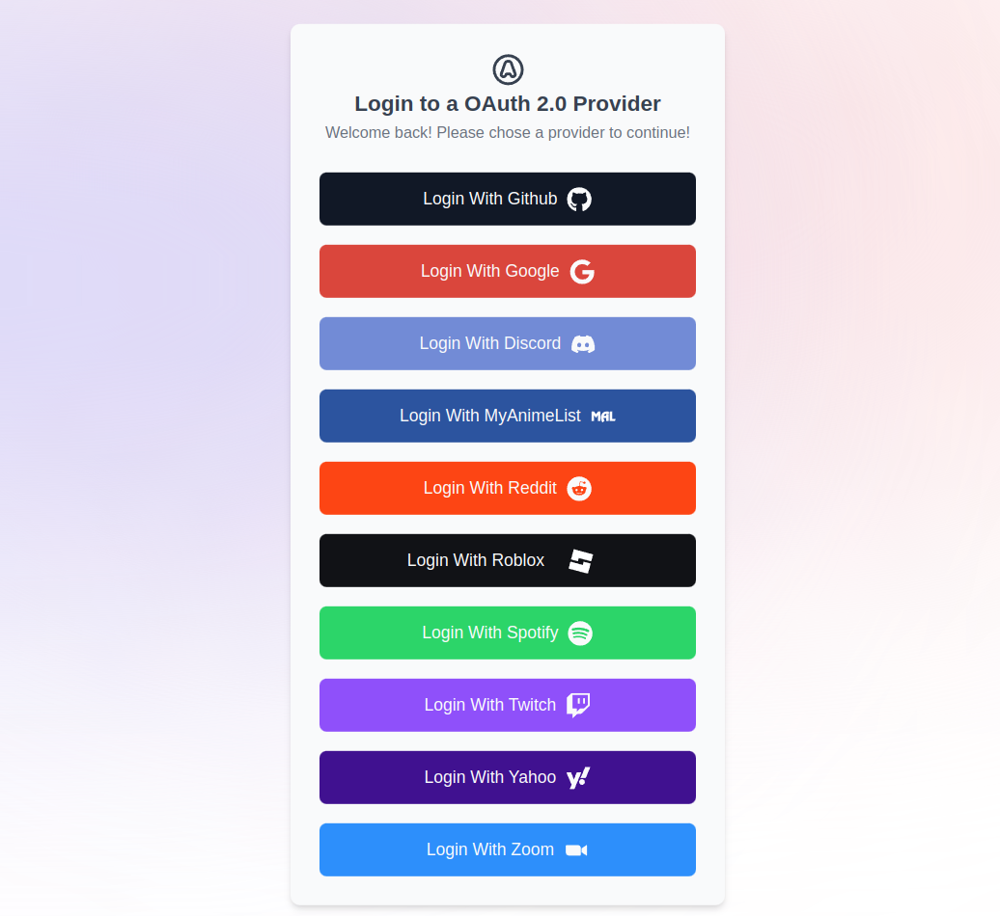

# MAX-OAUTH2.0-PROJECT



## About this project

This project is an implementation of 10 different OAuth2.0 providers using the following technologies: 
- next.js
- PostgreSQL
- drizzleORM
- Lucia Auth

I made this project with the intent of deeply learning the OAuth2.0 and for this project to be a future resource for myself and others developers to implement OAuth2.0.

## Booting it up

First start and configure the database

```bash
docker compose up

# Initialize the database tables with
npm run db:migrate
```

Second, run the development server:

```bash
npm run dev
# or
yarn dev
# or
pnpm dev
# or
bun dev
```


Open [http://localhost:3000](http://localhost:3000) with your browser to see the result.

You may need to edit the file src/end/server.ts because it's configured to disallow the boot of the app if any env variable is missing. 

You can remove the env variables for the providers that I don't want to test for the app to boot up.

